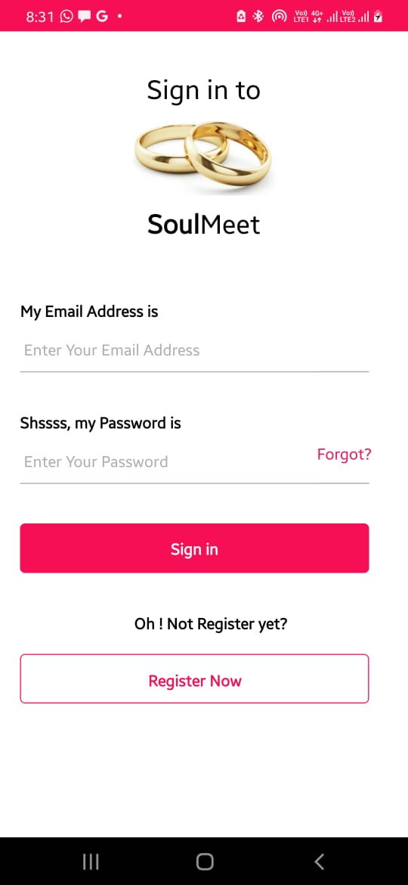
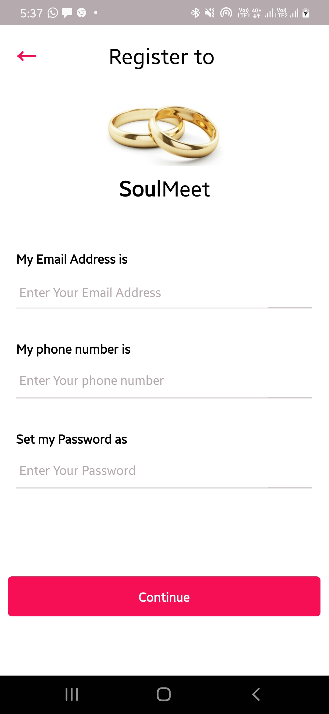
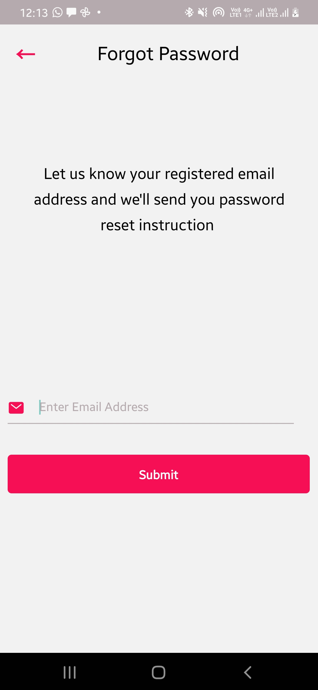
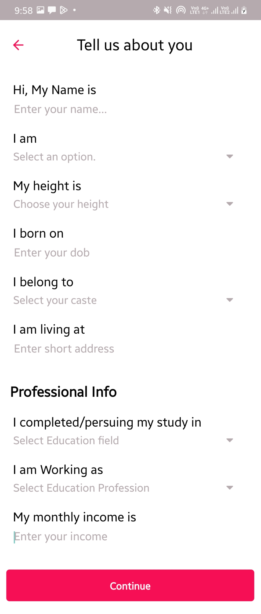
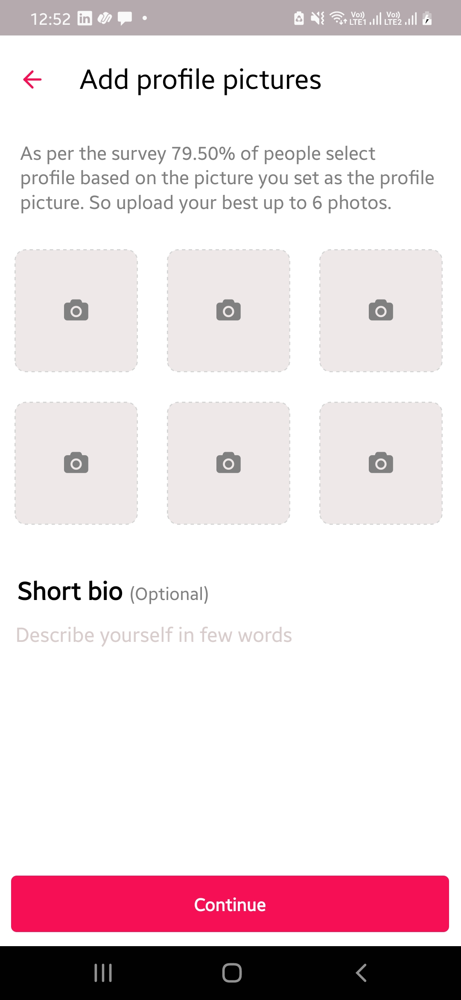
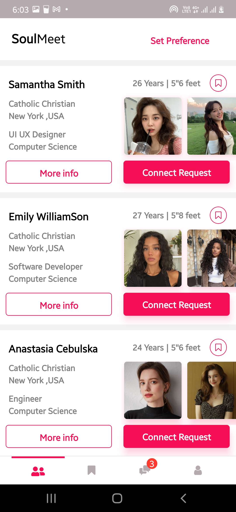
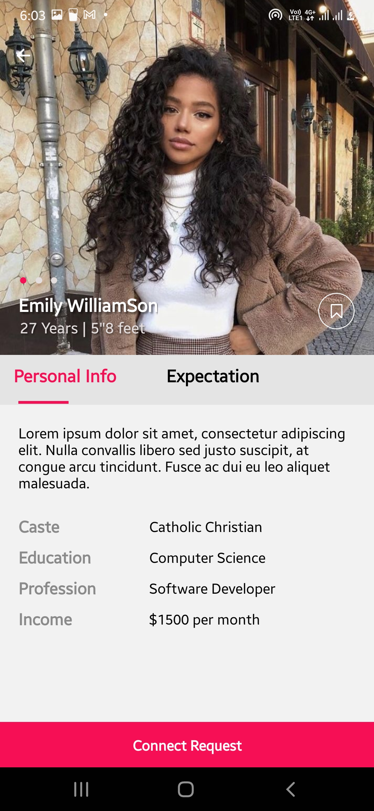
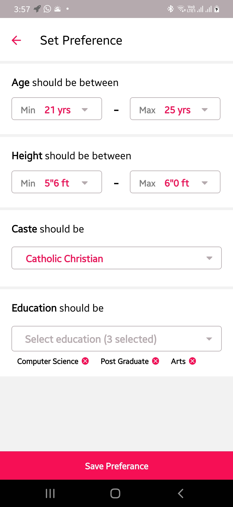
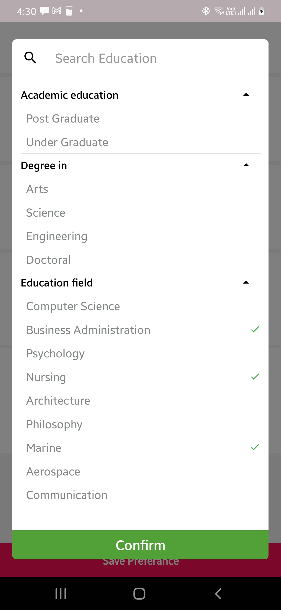

# SoulMeet - React Native CRM App

## Introduction
SoulMeet is a CRM (Customer Relationship Management) mobile application developed using React Native. This project was undertaken as a freelancing assignment for the group called ZerothIndex.The app consists of 11 distinct pages, each designed to facilitate various aspects of customer relationship management.

## Project Structure
The project is organized with the following key components:

- **Name:** soulmeet
- **Version:** 0.0.1
- **Scripts:**
  - `android`: Run the app on Android.
  - `ios`: Run the app on iOS.
  - `lint`: Run ESLint for code linting.
  - `start`: Start the React Native development server.

## Dependencies
SoulMeet utilizes various libraries and dependencies to enhance its functionality. Here are the main dependencies:

- **@react-native-community/datetimepicker:** Version 7.6.0
- **@react-navigation/bottom-tabs:** Version 6.5.11
- **@react-navigation/native:** Version 6.1.8
- **@react-navigation/native-stack:** Version 6.9.14
- **core-js:** Version 3.33.1
- **react:** Version 18.2.0
- **react-native:** Version 0.72.5
- **react-native-dropdown-select-list:** Version 2.0.5
- **react-native-image-picker:** Version 7.0.0
- **react-native-multiple-select:** Version 0.5.12
- **react-native-safe-area-context:** Version 4.7.2
- **react-native-screens:** Version 3.25.0
- **react-native-sectioned-multi-select:** Version 0.10.0
- **react-native-select-dropdown:** Version 3.4.0
- **react-native-vector-icons:** Version 10.0.0

## Node Version
The project is configured to run on Node.js version 16 and above.

## Screenshots
Include screenshots of different pages of the SoulMeet app here. You can use image hosting services or upload them directly to the repository.

### Login 

### Register 

### Forget Password 

### User About 

### User Profile update

### Home

### Detailed profile

### User Preference

## Conclusion
SoulMeet is a React Native CRM app that leverages various libraries to create a robust and user-friendly customer relationship management experience. For detailed information on each page's functionality and implementation, please refer to the source code and relevant documentation.
